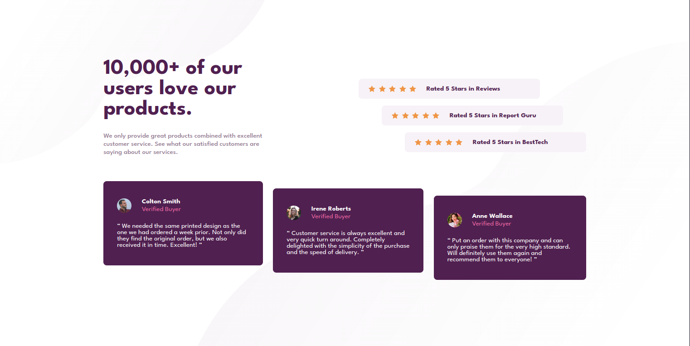

# Frontend Mentor - Social proof section solution

This is a solution to the [Social proof section challenge on Frontend Mentor](https://www.frontendmentor.io/challenges/social-proof-section-6e0qTv_bA). Frontend Mentor challenges help you improve your coding skills by building realistic projects. 

## Table of contents

- [Frontend Mentor - Social proof section solution](#frontend-mentor---social-proof-section-solution)
  - [Table of contents](#table-of-contents)
  - [Overview](#overview)
    - [The challenge](#the-challenge)
    - [Screenshot](#screenshot)
    - [Links](#links)
  - [My process](#my-process)
    - [Built with](#built-with)
    - [What I learned](#what-i-learned)
    - [Useful resources](#useful-resources)
  - [Author](#author)

## Overview

### The challenge

Users should be able to:

- View the optimal layout for the section depending on their device's screen size

### Screenshot

### Links

<!-- TODO: Solution URL -->
<!-- - Solution URL: [Add solution URL here](https://your-solution-url.com) -->
- Live Site URL: [GitHub Pages](https://lau-san.github.io/fm-social-proof-section/)

## My process

### Built with

- Semantic HTML5 markup
- Flexbox
- CSS Grid
- Mobile-first workflow
- [Sass](https://sass-lang.com)

### What I learned

I learned to make animations with CSS :)

### Useful resources

- [web.dev CSS Course | Animations](https://web.dev/learn/css/animations/) - I used this to learn how to make CSS animations with keyframes.

## Author

- Frontend Mentor - [@Lau-San](https://www.frontendmentor.io/profile/Lau-San)
